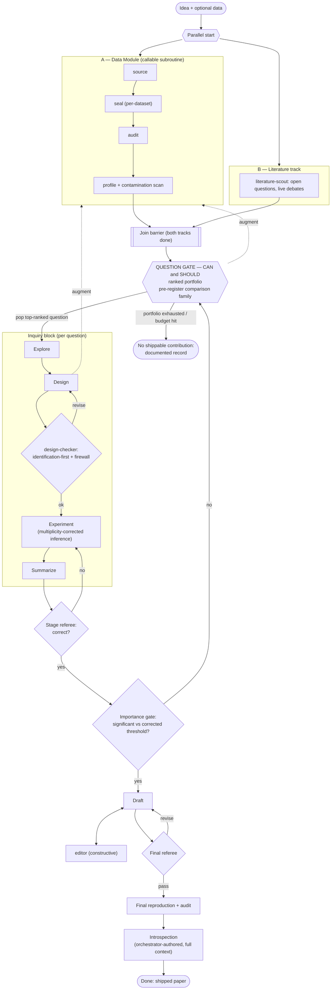

# Framework Plan: `spirit`

*Status: design plan (not yet built). Lineage: `gated` → `grounded` → `grounded2` → `spirit`.*

`spirit` is the fourth MiddAR framework. It keeps every rigor and contribution
guarantee of `grounded2` and reorganizes the pipeline around three structural bets:

1. **A parallel front end** — data preparation and literature run concurrently and
   independently, so the question set is not anchored on what the data happens to show.
2. **A ranked *question portfolio*** instead of a single frame — and the portfolio is
   tested with *honest multiplicity* so that trying many questions can't silently
   inflate false discovery.
3. **A reusable data module** — `source → seal → audit → profile` becomes a callable
   subroutine that can be invoked at intake, at the question gate, and at design.

Its other defining features: escalating **three-tier review**, an **importance-routed
loop** back to the portfolio, **"no contribution" as a first-class output**, and an
**orchestrator-authored introspection** that critiques the framework with full context.

---

## 1. The design loop at a glance



The governing rule, inherited from grounded2: **advance to the next gate only when the
prior gate's output exists on disk and its checks pass; state which gate you are
entering and why the prior one passed.** The pipeline is linear in *progression* but
allows several *controlled backward loops* (the dashed/return edges above).

---

## 2. Stage-by-stage

### Intake
Research idea (required) + dataset (optional). If no data is provided, the data module
self-sources it.

### Parallel front end (A ∥ B)
Two independent tracks run concurrently and meet at a join barrier:

- **A — Data Module** (`source → seal → audit → profile`): acquires/verifies/seals each
  dataset and profiles it. This is a **callable subroutine**, not a one-time stage — it
  is re-entered whenever augmentation is needed. Per-dataset sealing (the `protect_raw.sh`
  hook) makes re-entry safe: already-sealed datasets stay frozen while a new subdir is
  writable until sealed. The profiler also runs a **contamination scan** (see §4).
- **B — Literature track**: `literature-scout` in generative mode surveys the domain's
  live debates and highest-value *open* questions. Run in parallel with A so the
  question set is informed by the field, **not anchored on the data**.

**Why parallel:** keeps literature independent of data peeking, and saves wall-clock.
The join is a hard barrier — the question gate needs both.

### Question Gate — "CAN ∧ SHOULD" → ranked portfolio
The heart of the framework. Two orthogonal axes, kept separate:

- **CAN (feasibility):** Are the outcome/treatment/identifiers present? Is there a
  credible identification spine (RD / event-study / IV > descriptive TWFE)? Enough
  variation/N? — from `data-profiler` + identification reasoning.
- **SHOULD (importance):** Does answering move a belief or a decision? Interesting under
  **both** signs? Fills a gap the literature shows is open? — from `advisor` +
  `literature-scout`.

Ranking is **lexicographic, not a weighted scalar**: a question must clear a feasibility
*floor* to enter the ranking, then it is ranked by importance. Both scores are recorded.
A **high-SHOULD / low-CAN** question is not discarded — it **triggers the data module**
to acquire the dataset that would make it identifiable (the dashed "augment" edge).

Then the gate does the thing single-question grounded2 never had to: **it pre-registers
the entire ranked portfolio as the multiple-comparison family** (see §3).

### Inquiry block (per question)
Pop the top-ranked question and run `explore → design → experiment → summarize`:

- **Explore:** a clearly-labeled exploratory pass to find where the signal is. *Not*
  confirmatory.
- **Design:** pre-register the confirmatory design **after** explore, citing what it
  found; rank identification strategies and make the strongest feasible one the PRIMARY
  spine. May call the data module for a complementary identifying dataset before locking.
- **design-checker gate (pre-experiment):** an independent, forward-looking review —
  identification soundness, explore→confirm integrity (registered after explore and
  cites it), and **enforcement of the carry-forward firewall** (§4). Loops back to
  design until sound. Cheap, and runs *before* compute is spent.
- **Experiment:** the `econometrician` runs the registered design with
  **multiplicity-corrected inference** (§3) and reports diagnostics, never hiding
  failures.
- **Summarize:** write up the computed results (every number gets a `claims.json`
  provenance entry).

### Stage referee (post-results)
The hostile `referee` checks the completed experimental stage for correctness:
confounding, leakage, p-hacking, overclaiming, missing diagnostics, provenance. Loops
back to experiment/design until correct.

### Importance gate (post-stage)
The `advisor` re-evaluates: is the result **interesting and significant against the
multiplicity-corrected threshold**?
- **No →** route back to the **question portfolio** and pop the next question. The
  rejected question is recorded in the ledger as `INDEX-ONLY` (resolved-uninteresting)
  so it is never re-attempted.
- **Yes →** proceed to draft.

### Draft ⟷ Revise (editor)
A constructive **editor** sub-agent works the draft for clarity, structure, and honest
positioning. Distinct from the referee: the editor *improves*, the referee *blocks*.
Provenance discipline still applies — the editor may not introduce an unverified number.

### Final referee
A second hostile `referee` pass on the full paper. Loops back to draft until it passes.

### Final reproduction + audit
`run_all.sh` regenerates every table/figure/PDF **from the sealed data** and the values
must match the `.tex` within tolerance. For self-sourced data it verifies `data/raw`
against the per-dataset `.sealed` hashes and does **not** re-download. The audit checks
orphan numbers, citation reality, seal integrity, `claims.json` completeness, and the
**multiplicity disclosure** (§3).

### Introspection (orchestrator-authored)
The run ends with `introspection.md`, **authored by the main orchestrator agent with
full run context** — not by a fresh read-only subagent. Rationale: the orchestrator
lived the run and knows which loop-backs happened, why questions failed at the
importance gate, and where the firewall bit. A subagent reconstructing from disk
artifacts misses that lived process. (Tradeoff acknowledged in §7.)

---

## 3. Honest multiplicity — the portfolio's defining discipline

A portfolio that tries N questions against the same sealed data and ships the one that
"worked" is doing N-question spec search; false-discovery rate inflates across the
portfolio. grounded2's explore→confirm rule guards peeking *within* one question and
does nothing *across* questions. `spirit` defends this explicitly with the **small-N
default: multiplicity correction** (no held-out partition, so the data module needs no
split-rule step):

1. **Pre-register the portfolio** at the question gate — the ranked list *is* the
   comparison family.
2. **Family size = the pre-registered portfolio size** (the chosen default; the simplest,
   conservative rule — every registered question counts, whether or not it is ultimately
   run).
3. Each confirmatory experiment is one test in the family; the **importance gate judges
   significance against a corrected threshold** (Romano–Wolf or Benjamini–Hochberg FDR).
4. **Mandatory disclosure:** the paper reports how many questions were examined, and the
   final audit checks that count against the ledger. Multiplicity disclosed is honest;
   multiplicity hidden is the contamination.

Because there is no hold-out, two firewalls become more load-bearing: the
**explore→confirm within-question discipline** (now the only within-question firewall)
and the **cross-question `QUARANTINED` firewall** enforced by the design-checker (§4).

---

## 4. Carry-forward without contamination — the typed ledger

To avoid re-doing work across loop-backs *without* contaminating a fresh inquiry, every
artifact is tagged in a carry-forward ledger:

| Tag | Examples | Who may read it |
|---|---|---|
| `REUSABLE` | sealed data, schema/profile, leakage + contamination scan, literature, provenance, outcome-*independent* derived data (merges, deflation, geo crosswalks) | everyone, always |
| `INDEX-ONLY` | question fingerprint `(outcome, treatment, sample, estimand, identification)` + verdict | the **question-ranker** only (dedup + prioritization) |
| `QUARANTINED` | effect sizes, p-values, *which spec/split lit up*, prior summaries | importance gate, referee, final write-up — **never the design of a new question** |

The **design-checker enforces the firewall**: a new question's design may justify itself
only from `REUSABLE` facts + its own explore pass + literature — never from a
`QUARANTINED` prior result. This is what lets dedup learn "don't re-ask this" (via the
fingerprint + verdict) without feeding a prior *answer* into a new design.

**Reusing computed intermediates:** a derived dataset earns the `REUSABLE` tag only if
its construction never touched the outcome. A merge/deflation/crosswalk → `REUSABLE`; an
outlier-drop or window chosen *because it showed an effect* → `QUARANTINED`. The
data-profiler's leakage scan is extended into this **contamination scan** to gate the tag.

---

## 5. Agent roster

| Agent | Status vs grounded2 | Role |
|---|---|---|
| data-finder / data-checker / data-profiler | reuse | the callable data module; profiler also runs the contamination scan |
| literature-scout | reuse | parallel generative pass up front + defensive citations pre-draft |
| advisor | reuse, repositioned | the SHOULD half of the question gate + the importance gate |
| **question-ranker** | **new** (or fold into advisor) | synthesizes CAN ∧ SHOULD → ranked portfolio; owns the dedup index; pre-registers the comparison family |
| **design-checker** | **new** | forward identification / pre-registration review + carry-forward firewall enforcement |
| econometrician | reuse | explore, experiment (multiplicity-corrected inference), summarize |
| referee | reuse | stage referee + final referee (two invocations) |
| **editor** | **new** | constructive draft ⟷ revise partner (provenance discipline still applies) |
| ~~introspector~~ | **removed** | replaced by orchestrator-authored introspection |

Cheaper `sonnet` for mechanical acquire/compute/profile/edit work; `opus` for
judgment-heavy gatekeeping (check, advise, referee). Reviewers (`design-checker`,
`referee`) are read-only — they judge, they don't patch.

---

## 6. Non-negotiables

**Inherited from grounded2 (keep all):**
1. Per-dataset seal + `protect_raw.sh` hook; verified data only before sealing.
2. Real, verifiable citations only — never fabricated.
3. No orphan numbers — every numeral in `main.tex` maps to `validation/claims.json`.
4. Fresh-env reproduction; `run_all.sh` verifies sealed hashes and does not re-download.
5. Dataset-aware generation — never propose a hypothesis the data can't support.
6. A different model criticizes (the referee) before writing and before finalizing.
7. Validation data for any LLM-measured variable.
8. Diagnostics reported, never hidden.
9. Identification is the spine, ranked; a load-bearing analysis that fails to run is
   BLOCKING, never silently demoted.

**New in `spirit`:**
10. **Portfolio pre-registered + multiplicity-corrected.** The ranked question list is
    the comparison family; significance is judged against the corrected threshold; the
    number of questions examined is disclosed in the paper.
11. **Carry-forward firewall.** A new question's design may read only `REUSABLE` facts +
    its own explore + literature; never a `QUARANTINED` prior result. Enforced by the
    design-checker.
12. **"No contribution" is a valid terminus.** When the portfolio is exhausted or the
    budget is hit, the run may emit a documented "no shippable contribution found"
    record. The framework must never manufacture importance.

---

## 7. Termination & the introspection tradeoff

**Termination.** Three terminal states: (a) ship the paper (importance gate passed),
(b) ship an advisor-blessed null that overturns an *established* claim, or (c) emit a
documented **"no shippable contribution found"** record (portfolio + every attempt + why
each failed). The importance-routed loop is bounded by portfolio exhaustion + a compute
budget.

**Introspection tradeoff (acknowledged).** Orchestrator-authored introspection has the
richest context but is the *least independent* author — it grades its own run.
grounded2 bought objectivity with a fresh model. The chosen design favors context over
independence. **Optional extension (not in the default plan):** after the orchestrator
writes `introspection.md`, a fresh read-only subagent does a short independent red-team
pass flagging self-serving omissions — recovering some objectivity without losing the
lived-context authorship. Left out by default; easy to add later.

---

## 8. Directory contract (sketch, extends grounded2)

```
data/raw/<dataset>/        each dataset in its own subdir; frozen once .sealed exists
data/raw/<dataset>/.sealed per-dataset seal (never edit/delete)
data/SOURCE.md             provenance per dataset
api_keys.env               read-only; never print/log/write a key value
work/00_source 01_audit 02_profile
     03_questions           the ranked portfolio + pre-registered family + dedup index
     04_explore 05_design   per-question explore + registered design
     06_literature
     07_analysis 08_robustness
     09_pivot               importance-gate decisions / loop-back record
ledger.json                the typed carry-forward ledger (REUSABLE / INDEX-ONLY / QUARANTINED)
paper/                     main.tex + sections/ + tables/ + figures/ + references.bib
replication/               run_all.sh + manifest.json + README.md
validation/                data_check.json + claims.json + report.json
introspection.md           orchestrator-authored, end of run
```

---

## 9. Open items before building
None blocking. Defaults chosen: family-size rule **(i)** (pre-registered portfolio size);
**no** independent red-team pass on introspection by default (§7). Next step when ready:
draft `frameworks/spirit/CLAUDE.md`, `prompt.md`, `framework.json`, the `.claude/`
settings + hook, and the new/changed agent files.
