# Framework: `radio`

*Status: built; first run (`projects/test_06`) exercised the front end. Lineage:
`gated` → `grounded` → `grounded2` → `spirit` → `radio`.*

`radio` is the fifth MiddAR framework. It keeps every rigor and contribution guarantee of
`spirit` but reorganizes the run around one diagnosis from the last two introspections:
**we spend our most expensive tokens committing to questions we cannot yet tell are
feasible.** `test_05` (spirit) burned two full inquiry cycles (q3, q5) plus a dead-end
data pull (q2) on causal questions whose under-power was invisible to the question gate
until *after* design-lock — and the descriptive question that actually shipped (q8) was
ranked 4th. `radio` rests on three structural bets:

1. **Cheap previews before expensive commitment.** Before any question is pursued, a
   lightweight per-candidate *preview* (novelty check + design skeleton + an *opportunistic*
   back-of-napkin probe) tells the scorers what's actually promising — so under-powered or
   non-novel questions are demoted *before* a single full inquiry cycle is spent.
2. **Ensemble generation + scoring against a publication ladder.** Three proposers (top-3
   ideas each → collate) and three scorers (1–10 each → sum, max 30) replace `spirit`'s
   single `question-ranker`. They judge against `guides/QUESTION_GUIDES.md`: **Tier 1** =
   publishable in a top-5 journal; if nothing clears that gate, the same candidates are
   **re-scored at Tier 2** (strong field/applied), which relaxes importance and the leap but
   never identification or honesty. "No viable paper" fires only when both tiers fail.
3. **Slim the heavyweight discipline, keep the adversarial backstop.** `spirit`'s
   pre-registered multiplicity portfolio and typed carry-forward ledger are both trimmed
   (pursuing one de-risked question shrinks the need for both); the different-model
   `referee` and the named `design-audit` / `experiment-audit` gates remain the load-bearing
   guard, and **"no viable paper"** stays a first-class terminus.

Other defining features: a **bounded loop** from Experiment Review back to the ranked list,
framework-**shipped reproduction primitives** (no hand-rolling `orphan_check.py` mid-run),
**data-handling/token discipline** so large datasets never enter an agent's context, and an
**orchestrator-authored introspection**. Every located fix from the `test_04`/`test_05`
introspections is carried as a stage step or a non-negotiable below.

---

## 1. The run loop at a glance

```mermaid
flowchart TD
  START["Intake: ≥1 of domain / idea / data folder<br/>settings: augment-data, iteration-limits, target-tier"] --> FE
  subgraph FE["Parallel front end — orchestrator spawns sub-agents"]
    SCAN["Data Scan ×N<br/>search → evaluate → summarise (no acquisition)"]
    LIT["Lit-Domain<br/>find → eval → summarise → gaps / next-steps"]
  end
  FE --> GEN["Generate questions<br/>3 proposers × top-3 → collate & dedup"]
  GEN --> PREV["Question previews — per candidate, parallel<br/>1) novelty 2) design skeleton 3) napkin probe*"]
  PREV --> SC1["Evaluate @ Tier 1 (top-5)<br/>3 scorers × 1–10 → sum (max 30)"]
  SC1 --> G1{"top &gt; 20<br/>& attempts left?"}
  G1 -- "yes" --> PURSUE["Use top question<br/>active_tier = 1"]
  G1 -- "no" --> SC2["RE-SCORE same candidates @ Tier 2<br/>(reuse previews, NO new generation)"]
  SC2 --> G2{"top &gt; 20<br/>on Tier-2 scale?"}
  G2 -- "yes" --> PURSUE2["Use top question<br/>active_tier = 2"]
  G2 -- "no" --> NOPAPER["Terminate: GRADED no-viable-paper<br/>(best candidate + reachable tier)"]
  PURSUE --> DSRC
  PURSUE2 --> DSRC
  DSRC["Data Source (if needed)<br/>search → source → seal → audit → profile"] --> DESIGN["Develop Design"]
  DESIGN --> DAUDIT{"Design Audit<br/>sound? answers Q? confound test named?"}
  DAUDIT -- fail --> DESIGN
  DAUDIT -- pass --> EXP["Run experiments ×N parallel<br/>claims at estimate-time; units; confound test; split scripts"]
  EXP --> EAUDIT{"Experiment Audit<br/>correct? units? SE? confound ran?"}
  EAUDIT -- fail --> EXP
  EAUDIT -- pass --> EREV{"Experiment Review<br/>deserves a paper AT active_tier?"}
  EREV -- no --> NEWQ{"New interesting<br/>question raised?"}
  NEWQ -- "yes: score the new Q only" --> SC1
  NEWQ -- "no: take next ranked Q" --> NEXTQ{"Ranked list left<br/>& attempts remain?"}
  NEXTQ -- yes --> DSRC
  NEXTQ -- no --> NOPAPER
  EREV -- yes --> DRAFT["Writer drafts + revises (parallel sections)<br/>spawns editor advisories; frame at active_tier"]
  DRAFT --> FEDIT["Final Editor — checks vs PAPER_GUIDES.md"]
  FEDIT --> OAIR["/openaireview skill — final pass"]
  OAIR --> FREF{"Final Referee<br/>can ask for any change"}
  FREF -- changes --> DRAFT
  FREF -- clean --> REPRO["Reproduce + audit (shipped primitives)"]
  REPRO --> INTRO["introspection.md — main orchestrator"]
  INTRO --> DONE(["done"])
```



`*` **napkin probe** = run a live data probe *only* if data is already on hand or
pullable + analyzable in **under ~1 minute**; otherwise reason qualitatively. A *signal* for
the scorers, not a result.

**Governing rule (inherited):** advance to the next gate only when the prior stage's output
exists on disk and its checks pass; when you enter a gate, state which it is and why the
prior passed. Record each stage boundary in `validation/report.json` so a crash resumes.

---

## 2. Stage-by-stage

### Intake
Read `EXPERIMENT.md`; require ≥1 of domain / idea / data. Read `settings`: `augment-data`
(on/off), `iteration-limits` (max question-attempts / design-audit loops / experiment-audit
loops), and `target-tier` (`ladder` default, or `top-5-only`).

### Parallel front end (Data Scan ∥ Lit-Domain)
- **Data Scan** — fan out `data-scout` ×N over different angles: *search* (web + API
  endpoints) → *evaluate* reliability → *summarise* available data. **No acquisition.**
  → `work/00_scan/data_landscape.md`.
- **Lit-Domain** — `literature-scout` (generative): *find → evaluate → summarise → identify
  gaps & next-steps → audit*. → `work/00_scan/lit_landscape.md` + `gaps.md`. Kept independent
  of the data so questions aren't anchored on data peeking.

### Generate questions
Three `question-proposer` agents, **top-3 each**, judged against `guides/QUESTION_GUIDES.md`
and informed by the scan + lit landscapes. Collate/dedup → candidate pool (~5–9) →
`work/01_questions/candidates.json`.

### Question previews — the new core (parallel)
One `question-previewer` per candidate, in parallel. Each writes
`work/01_questions/previews/q<k>.md`: (1) a quick **novelty** verdict, (2) a **design
skeleton**, (3) an **opportunistic feasibility/power probe** (live only if cheap; else
reason). Deliberately not rigorous — it is the cheap de-risking signal.

### Evaluate / rank — the publication ladder
Three `question-scorer` agents score **every** candidate **1–10** reading the previews,
against the three editor tests in `guides/QUESTION_GUIDES.md`.
- **Tier 1 (top-5):** §5 anchors. Sum (max 30) → `scores.json` + `ranked.json`. **Gate:**
  pursue only if top score **> 20** and attempts remain → `active_tier = 1`.
- **Tier-2 fallback** (default `target-tier: ladder`): if no Tier-1 winner, **re-score the
  same candidates once** at Tier 2 (§6 anchors, reuse the previews, **no new generation**).
  Clears > 20 on the Tier-2 scale → pursue → `active_tier = 2`.
- The cheap Tier-2 re-score is the **only sanctioned fallback** — a regeneration/"sharpening"
  round (new proposers + previews) is **not** a default (it is ~300k tokens and rarely moves
  the gate; chasing a bar with manufactured reframes is the spec-search non-negotiable 9
  forbids). `active_tier` is written to `report.json`/`ledger.json` and propagates downstream.

### Use Top Question → Data Source
Acquire any data the question needs: *search → source → seal (per-dataset) → audit →
profile*. Augmentation allowed mid-run; sealed datasets stay frozen. Output `work/02_data/`,
raw under `data/raw/<dataset>/`.

### Develop Design → Design Audit
A sub-agent pre-registers the design (identification ranked, strongest feasible spine
PRIMARY, must-pass diagnostics, a fallback ladder for any primary estimator). The
`design-auditor` (Pass/Fail) checks identification soundness, that it answers the question,
**that the mandatory confound test is named**, and the no-peek firewall. Fail loops back
(bounded).

### Experiments (parallel) → Experiment Audit
`econometrician` sub-agents code & run the experiments in parallel — **claims registered at
estimate time**, an explicit **units** field on every number, **conservative SE** for any
null/robust claim, the **confound test actually run**, long scripts **split/checkpointed**.
The `experiment-auditor` (Pass/Fail) verifies all of that + deviation re-validation. Fail
loops back (bounded).

### Experiment Review
`experiment-reviewer` asks: does this deserve a paper **at the run's `active_tier`** (Tier 1
top-5, or Tier 2 field/applied — rigor and the confound test hold regardless)?
- **No** → if a **new** question was raised, score just that (at the active tier) and merge
  into `ranked.json`; else take the **next ranked question** (no re-scoring). Mark the spent
  attempt no-peek. Terminate as no-viable-paper only when the ranked list / attempts exhaust.
- **Yes** → literature gate + draft.

### Paper (parallel drafting) → Final Editor → openaireview → Final Referee
`writer` drafts & revises with `editor` advisories, **sections in parallel**, **framed at the
active tier** (a Tier-2 paper is positioned honestly as field/applied, not dressed as top-5).
`final-editor` checks against `guides/PAPER_GUIDES.md` (the condensed ~3-page rubric, not the
source PDFs). The `/openaireview` skill runs on the final pass, then the `referee` may request
any change and loops back until clean. Citations alphabetical.

### Close (shipped primitives + orchestrator introspection)
`replication/run_all.sh` regenerates every number from sealed data; `verify_seals.py`
re-verifies the per-dataset hashes; `orphan_check.py` confirms provenance; the audit also
checks citation reality, seal integrity, units, and the multiplicity disclosure. Then the
**orchestrator itself** writes `introspection.md` and `validation/report.json`, and stops.

---

## 3. Defining discipline — parallel lightweight sub-agents + token discipline

`radio` always prefers sub-agents and fans out wherever work is independent: data scans
(×N), proposers (×3), previews (×candidate), scorers (×3), experiments (×N), paper sections
(×N). Many *cheap* agents up front buy the information that avoids the *expensive* dead ends.

**Model tiers.** `haiku` for cheap fan-out (data-scout, proposers, scorers); `sonnet` for
mechanical compute/acquire/profile/draft (data-finder, data-profiler, question-previewer,
econometrician, writer, editor, final-editor); `opus` for the judgment gates and review
(data-checker, literature-scout, design-auditor, experiment-auditor, experiment-reviewer,
referee). The two pure reviewers (`referee`, `design-auditor`) are read-only.

**Data-handling / token discipline.** Sealed datasets are large (multi-MB / 10^5+ rows).
Loading a file into a pandas process is free; only what an agent *prints* or *Reads* into
context costs tokens — a full file is millions of tokens. So every data-touching agent pulls
to disk (`curl -sS -o`), computes **in code**, and emits only **bounded** summaries
(`df.shape`/`dtypes`/`head(10)`/`describe()`/hashes; tables ≤20 rows / ~30 cols) — never
`cat`, `Read`-in-full, or `print()` a whole dataframe. Quality-neutral: correctness needs
shape/schema/sample/hash, not raw rows in context.

**Acquisition efficiency.** `data-finder` plans the pull up front: prefer a bulk/full-table
download over a row-paginated API; when paginating, get the count first then page at max
size with date/geo chunks; respect rate limits (back off to bulk on a 429); self-limit
(>30–40 calls on one dataset → stop and rethink).

**Resource discipline.** Split any script that could time out; checkpoint each stage in
`validation/report.json` so a crash resumes rather than restarts.

---

## 4. Slimmed disciplines (vs `spirit`)

- **Honest multiplicity → conditional / within-design.** No pre-registered cross-question
  family. The comparison family is the hypotheses tested *within the shipped design*; apply
  a BH-FDR correction only when >1 is tested, and **disclose** how many questions were
  generated / previewed / pursued.
- **Carry-forward ledger → slim "no-peek" firewall.** No per-artifact REUSABLE/INDEX-ONLY/
  QUARANTINED tagging. When Experiment Review spawns a new question, the prior attempt's
  result dirs are marked **no-peek** so the fresh design can't inherit its answer; enforced
  by the file-access firewall + a `design-auditor`/`referee` check. `ledger.json` survives
  only as this thin loop-back record (plus the `active_tier`).

---

## 5. Agent roster (16 sub-agents)

| Agent | Status vs `spirit` | Model | Role |
|---|---|---|---|
| `data-scout` | **new** | haiku | Data Scan: web/API search → evaluate reliability → summarise. No acquisition. |
| `data-finder` | reuse + batching guidance | sonnet | Data Source: acquire datasets into `data/raw/<ds>/`; bulk-first, rate-limit aware. |
| `data-checker` | reuse | opus | Skeptical correctness + fitness audit before sealing. |
| `data-profiler` | reuse | sonnet | Schema / distributions / missingness / leakage scan; no-peek tagging. |
| `literature-scout` | reuse (2 modes) | opus | **Lit-Domain** (front-end gaps) + **defensive** (real BibTeX + positioning). |
| `question-proposer` | **new** (×3) | haiku | Top-3 questions each, judged vs `QUESTION_GUIDES.md`. |
| `question-previewer` | **new** (×candidate) | sonnet | Novelty + design skeleton + opportunistic probe → one-page preview. |
| `question-scorer` | **new** (×3) | haiku | Scores every candidate 1–10 at the named tier (1 or 2), reading previews. |
| `design-auditor` | rename of `design-checker` | opus | Pass/Fail design gate; identification; **demands the confound test**; no-peek firewall. |
| `econometrician` | reuse (×N parallel) | sonnet | Runs experiments; claims-at-estimate-time, units, conservative SE, confound test, split scripts. |
| `experiment-auditor` | **new** | opus | Pass/Fail: correctness + units + SE + confound-ran + deviation re-validation. |
| `experiment-reviewer` | rename of `advisor` | opus | "Deserves a paper at active_tier? new questions?" — contribution gate + loop-back. |
| `writer` | **new** | sonnet | Drafts + revises (parallel sections); frames at active_tier. |
| `editor` | reuse | sonnet | Constructive draft partner; may not introduce an unverified number. |
| `final-editor` | **new** | sonnet | Checks the full draft against `guides/PAPER_GUIDES.md`. |
| `referee` | reuse | opus | Hostile final reviewer; read-only; only ever shrinks the claim. |
| ~~`question-ranker`~~ | **removed** | — | Replaced by the proposer + scorer ensemble. |

Introspection has **no agent** — it is orchestrator-authored.

---

## 6. Non-negotiables (the built set; see `CLAUDE.md` for full text)

**Inherited:** verified-data-only · real-citations-only · no-orphan-numbers · fresh-env
reproduction · a-different-model-criticizes · diagnostics-reported · load-bearing-analysis-
blocking · "no viable paper" is valid · orchestrator-authored introspection · per-dataset
seal hook.

**New in `radio`:** the **publication ladder** (Tier 1 first, Tier 2 fallback; relaxes
importance/leap only, never identification/feasibility/honesty) · preview-before-commit ·
opportunistic power signal · claims-at-estimate-time · units field mandatory · conservative
SE for null/robust claims · mandatory executable confound test before any causal bless ·
registered-deviation re-validation · split scripts + per-stage `report.json` checkpoint ·
ships reproduction primitives · paper checked vs `PAPER_GUIDES.md` · citations alphabetical.
Plus two operating guards: **data-handling/token discipline** (§3) and **no sharpening rounds
to chase a gate** (the Tier-2 re-score is the only sanctioned fallback; §2 Evaluate).

---

## 7. The publication ladder (detail)

- **Tier 1 — top-5 general interest:** AER, QJE, JPE, Econometrica, REStud. Broad
  significance + a large leap.
- **Tier 2 — strong field / applied:** AEJ: Applied/Policy, AER: Insights, JHR, JPubE, JOLE,
  JEEM, REStat. A credibly-identified, honest contribution that matters to a field.

**What recalibrates at Tier 2 — and what does not.** Relaxes **importance/broad-interest**
(field/policy relevance is enough) and **the leap** (a solid incremental advance / new
setting / careful measurement qualifies). Holds at full strength: **identification,
feasibility, honesty** — a rigor or feasibility failure caps the score at ~4 on *both* tiers.
That asymmetry is what keeps the fallback honest (importance can drop a question two tiers; a
broken design cannot be laundered into a paper). The active tier propagates to the
`experiment-reviewer` (judge at that tier) and the `writer` (frame at that tier) so a Tier-2
question is never re-failed for "not being top-5" after a full inquiry cycle. Full rubric +
anchors: `guides/QUESTION_GUIDES.md` §5–§6.

---

## 8. Termination & loops

Terminal states (introspection authored in all):
- **Ships a paper** at Tier 1 or Tier 2 — reproduces from sealed data and passes the audit.
- **No-viable-paper** — only when **both** tiers fail at the gate, or the ranked list /
  question-attempts exhaust with nothing shippable. Emits a **graded** summary: the best
  candidate and the tier it could realistically reach with better data.

Bounded backward loops (by the iteration limits): Design Audit → Develop Design, Experiment
Audit → run experiments, Final Referee → draft. After an Experiment Review "No": a **new**
question is scored (at the active tier) and merged; otherwise the **next ranked question** is
taken (no re-scoring). The spent attempt is marked no-peek either way.

---

## 9. Directory contract

```
data/raw/<dataset>/(.sealed)             # per-dataset seal (protect_raw.sh)
guides/            QUESTION_GUIDES.md  PAPER_GUIDES.md     # SHIPPED reference rubrics
work/00_scan/      data_landscape.md  lit_landscape.md  gaps.md
work/01_questions/ candidates.json  previews/q<k>.md  scores.json  ranked.json
work/02_data/      profile.md  profile.json                # Data Source: acquire + profile
work/03_design/    q<k>/design.md  q<k>/design_audit.md
work/04_experiments/ q<k>/{scripts,logs,tables,figures}  summary.md  experiment_audit.md
work/05_review/    experiment_review.md  new_questions.md   # loop-back records
work/06_literature/ lit_review.md                          # defensive refs (alphabetical)
paper/             main.tex  sections/  tables/  figures/  references.bib
replication/       run_all.sh  orphan_check.py  verify_seals.py  manifest.json   # SHIPPED
validation/        claims.json  data_check.json  report.json (incl. active_tier)
ledger.json        introspection.md
```

`framework.json`: `name=radio`, `requires_input=true`, `supports_no_data=true`,
`supports_augment=true`, `seal_mode="per-dataset"`, `uses_api_keys=true`, plus
`skeleton_dirs` matching the tree above — the same flags `spirit` declares, so **`tool.py`
needs no change** beyond skipping this README at `gen`.

---

## 10. Running it

```
python3 tool.py gen <name> --framework radio --domain "<area>"     # and/or --idea, and/or paste data
python3 tool.py run <name>                                          # or: run <name> --no-data to self-source
```
`gen` copies the framework into `projects/<name>/` (this README is documentation and is **not**
shipped into the project), seals any provided data, syncs `api_keys.env`, and prints the launch
command. `run` prints `cd projects/<name> && claude --dangerously-skip-permissions "$(cat prompt.md)"`.

### Exercised so far (`test_06`)
A domain-only `--no-data` run on local economic recovery from weather events reached a clean
**no-viable-paper at the front end** (top score 18/30 at the Tier-1 bar; the previews cheaply
killed two clever-but-illusory RD reframes before any compute). That run motivated the
post-build changes folded in above: the **Tier-2 publication-ladder fallback** (an 18/30 is a
solid AEJ:Applied paper, not "nothing"), the **token/data-handling discipline** (after data
agents slurped multi-MB files), `data-finder` **batching guidance** (after a 50-min / 332-call
paginated pull), and the **no-sharpening-round guard** (after a ~300k regeneration round that
didn't move the gate). See the run's `introspection.md` for the original findings.
